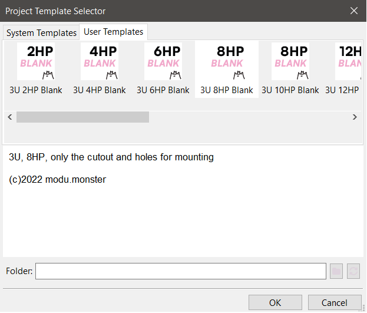
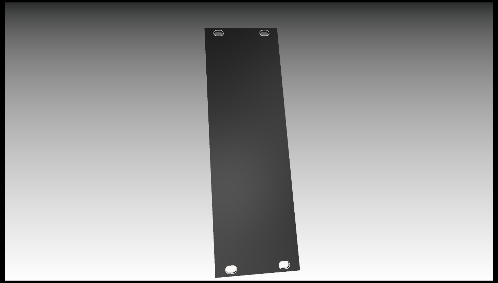

# PanelTemplates - KiCad Templates for creating EURORACK panels
##### Do you want to create PCB Eurorack panels in KiCad? This is the hassle free way to set up the basics.

How to use it?

1. Download this repository and put it *preferrably* in your KiCad templates folder. Make sure you unzip the .zip

###### KiCad templates can be found by clicking Preferences -> Configure paths, find KICAD_USER_TEMPLATE_DIR

2. Open KiCad (make sure you are on 6.0.5 or newer)
3. Click on File -> New Project from Template
4. Click on user templates and select the folder of PanelTemplates

###### Now all of the templates are showing up, select the size you want
5. Click OK and select where to create your KiCad panel project

##### For now this project contains blank templates for 3U panels in these widths:
- 02HP -  9.8  mm
- 04HP - 20    mm
- 06HP - 30    mm
- 08HP - 40.3  mm
- 10HP - 50.5  mm
- 12HP - 60.6  mm
- 14HP - 70.8  mm
- 16HP - 80.9  mm
- 18HP - 91.3  mm
- 20HP - 101.3 mm
- 21HP - 106.3 mm
- 22HP - 111.4 mm
- 28HP - 141.9 mm
- 42HP - 213   mm

Everything is according to [Doepfer A-100 Construction Details](https://doepfer.de/a100_man/a100m_e.htm).

These templates for now just include edge cuts of the right size with plated oval holes.

###### Shoutout to [@mzourack](https://github.com/mzourack) for his oval holes lol.

##### Discussion, feedback and feature requests are welcome. Just hop on into the discussion section or create a new issue.
